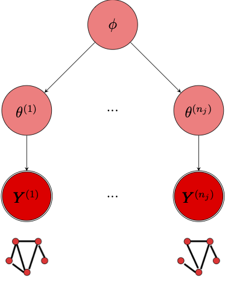

```{r, include = FALSE}
knitr::opts_chunk$set(
  collapse = TRUE,
  comment = "#>"
)
ggplot2::theme_set(ggplot2::theme_minimal())
```

# Getting multibergm

The **multibergm** package can be installed from github and loaded into R using 
the following commands:

```{r setup, message = FALSE}
#devtools::install_github("brieuclehmann/multibergm")
#library(multibergm)
devtools::load_all()
```

# Statistical network modelling with ERGMs

The **multibergm** package is a set of tools to fit multiple networks using 
Bayesian exponential random graph models (ERGMs). An ERGM defines a parametric 
statistical distribution across all possible networks with a given set of nodes.
The aim of the model is to characterise the distribution of a network in terms 
of a set of summary statistics. These summary statistics are typically comprised
of topological features of the network, such as the number of edges and subgraph 
counts.

**multibergm** is built on and inspired by the **ergm** R package 
[@Hunter2008, @Handcock2020], and uses the 
same syntax to specify models. The rest of this tutorial will assume some 
familiarity with ERGMs. For an introduction to the **ergm** package,
see the following vignette:

```{r ergm-vignette, eval = FALSE}
vignette("ergm")
```

# Loading data

To get started with some network data, the **multibergm** package includes a
social network dataset from David Krackhardt's study on cognitive social
structures [@Krackhardt1987]. The dataset consists of a set of friendship 
networks between 21 managers of a high-tech firm. 

We'll use this data to demonstrate the functionality of **multibergm**. You can 
load these by entering the following command.

```{r load}
data(krackfr)
```

This loads a list consisting of two elements. The first element 
`krackfr$networks` contains a list of 21 friendship networks, each corresponding
to the perceived network of one of the managers. The second element 
`krackfr$self` consists of a single network with edges corresponding to 
self-identified friendships. You can inspect these networks using `plot`. 
Here is a plot of the self-identified friendship network:

<!-- # ```{r plot_net} -->
<!-- # plot(krackfr$self) -->
<!-- # ``` -->

# The multibergm framework

The purpose of this package is to fit populations of networks using exponential
random graph models. To do so, we use a Bayesian hierarchical model.

```{r, echo=FALSE}
 
```

We model each individual network $\pmb{Y}^{(i)}$ as an exponential random graph
with model parameter $\theta^{(i)}$. Importantly, each individual ERGM must
consist of the same set of summary statistics $s(\cdot)$. The probability mass
function of each network can then be written
\begin{equation}
\pi(\pmb{y}^{(i)}|\theta^{(i)}) = \dfrac{\exp\left\lbrace\theta^{(i)T}s(\pmb{y}^{(i)})\right\rbrace}{Z(\theta^{(i)})}, ~~~ i = 1, \dots, n.
\end{equation}
This specifies the data-generating process for each individual network. To
obtain a joint distribution for the set of networks, we assume that, conditional
on their respective individual-level parameters, the $\pmb{Y}^{(i)}$ are
independent. Thus, the sampling distribution for the set of networks $\pmb{Y}$
is simply the product of the individual probability mass functions:
\begin{equation}
\begin{split}
\pi(\pmb{y}|\pmb{\theta}) &= \prod_{i=1}^n \pi(\pmb{y}^{(i)}|\theta^{(i)}) \\ \label{eq:likelihoodNets}
& = \dfrac{\exp\left\lbrace\sum_{i=1}^n \theta^{(i)T}s(\pmb{y}^{(i)}) \right\rbrace}{\prod_{i=1}^n Z(\theta^{(i)})}.
\end{split}
\end{equation}

To model a group of  networks we need to specify the prior distribution of the
individual-level ERGM parameters $\theta^{(1)}, \dots, \theta^{(n)}$ (for
individuals $1,\dots,n$). To this end, we propose a multilevel model such that
$\theta^{(1)}, \dots, \theta^{(n)}$ are drawn from a common population-level
Normal distribution with parameters $\phi = (\mu, \pmb{\Sigma}_{\theta})$, which
are also treated as random variables. We write
\begin{equation}
\theta^{(i)} \sim \mathcal{N}(\mu, \pmb{\Sigma}_{\theta}), ~~ i = 1, \dots, n_j
\end{equation} 
for the population-level distribution. Assuming that, conditional on $\phi$, the
$\theta^{(i)}$ are independent, we have
\begin{equation} \label{eq:thetaDist}
\pi(\pmb{\theta}|\phi) = \prod_{i=1}^{n} \pi(\theta^{(i)}|\mu, \pmb{\Sigma}_{\theta}). 
\end{equation}
Finally, write $\pi(\phi)$ for the (hyper)prior distribution of $\phi$.
The joint distribution of $(\pmb{Y}, \pmb{\theta}, \phi)$ can be written as
$\pi(\pmb{y}, \pmb{\theta}, \phi) = \pi(\pmb{y}|\pmb{\theta})\pi(\pmb{\theta}|\phi)\pi(\phi)$. 

## Using `multibergm`

To illustrate the functionality of `multibergm`, we will use the simplest
possible model for the 21 friendship networks, an Erdos-Renyi model, containing 
only an edge term. Note that this may take a minute or two to run.

```{r fit_edges, results=FALSE}
set.seed(1) # for reproducibility
fit1 <- multibergm(krackfr$networks ~ edges)
```

By default, this produces 1000 posterior samples from the model. We can control
the number of samples using the `main_iters` argument. We can plot the MCMC 
output for the group-level parameter $\mu$:

```{r plot_mcmc, fig.width=6}
plot(fit1)
```

The middle panel trace plot shows that the chain spends the first couple of 
hundred iterations 'warming-up'. We can discard these iterations using the
`burn_in` argument:

```{r plot_mcmc_burn, fig.width=6}
plot(fit1, burn_in = 200)
```

We can also produce some summary output of the MCMC posterior samples:

```{r summary_mcmc_burn}
summary(fit1, burn_in = 200)
```

This gives the posterior mean, standard error, and quantiles of each of the 
parameters in the model, in this case just the edges parameter. The summary 
output also provides the acceptance rates for the individual-level (theta) and 
group-level (mu) parameters - more on this below.

## Prior specification

The default (hyper)priors on the group-level parameters $(\mu, \Sigma_\theta)$
are:
$$
\begin{aligned}
\mu &\sim \mathcal{N}(0, 100I) \\
\Sigma_\theta &\sim \mathcal{W}^{-1}(p+1,~I)
\end{aligned}
$$
where $p$ is the number of summary statistics in the model and 
$\mathcal{W}^{-1}$ denotes an inverse-Wishart distribution. 

These can be manually specified using the `set_priors` function, which takes as
input a list for the corresponding parameters:

```{r set_priors}
prior <- list(mu_pop    = list(mean  = 0,
                               cov   = diag(100, 1)),
              cov_theta = list(df    = 2,
                               scale = diag(1, 1)))
```

# Goodness of fit

We can assess model adequacy via graphical goodness-of-fit. We do so by 
simulating networks from the posterior predictive distribution. That is, we 
select at random $m$ values from the posterior samples of the group-level
paramater $\mu$, then simulate a network from each value. By comparing these
simulated networks with the observed networks, we can check visually whether or
not the fitted model can produce networks with similar characteristics to the 
observed data.

```{r gof_simple, fig.width=6, fig.height = 7}
gof(fit1, burn_in = 200)
```

By default `gof` simulates 100 networks from the posterior predictive. The box
plots correspond to the observed networks while the ribbons correspond to the
the simulated networks. The sets of networks are compared on the distributions
of geodesic distance, edgewise shared-partners and degree. 

# Speeding up the MCMC

The algorithm used to produce posterior samples is fairly computationally 
expensive. To reduce the computational burden, we suggest initialising the 
Markov chain with sensible values, and adjusting the size of the MCMC proposals.

## Initial values

By default, the initial values for the MCMC algorithm are drawn from the 
respective prior distributions. There is nothing wrong with this approach; the
Markov chain will eventually reach regions of parameter space with high
posterior probability irrespective of the starting value. Indeed, discarding the
first `burn_in` iterations serves to ignore this initial exploratory phase. 

We have found in practice, however, that this exploratory phase can be
particularly computationally intensive. We recommend instead initialising the
algorithm with some sensible values based on single network fits:

```{r single_fit, results=FALSE, message=FALSE}
single_fits  <- lapply(krackfr$networks, function(x) ergm(x ~ edges))
single_coefs <- as.matrix(sapply(single_fits, coef))

init <- list()
init$mu_pop    <- colMeans(single_coefs)
init$theta     <- sweep(single_coefs, 1, init$mu_pop)
init$cov_theta <- cov(init$theta)
```

These initial values can be passed to the MCMC algorithm as follows:

```{r initialise, results=FALSE}
fit2 <- multibergm(krackfr$networks ~ edges, init = init)
```

We can check the trace plot to see whether we still have an exploratory phase:

```{r plot_initialise, fig.width=6}
plot(fit2)
```

## MCMC proposals

Another important aspect of the MCMC algorithm are the Metropolis proposals. 
These control how efficiently the chain explores the parameter space. 

**BL: I'm thinking of implementing an adaptive MCMC so that users don't need to worry about tuning proposals...**

# Other functionality

## Parallel computation

Some of the computation within the MCMC algorithm can be performed in parallel.
You can control the number of cores used via the `n_batches` argument in
`control_multibergm`. This can significantly reduce the computation time.

## Multiple groups

`multibergm` can also fit populations of networks containing multiple groups.
To do this, just specify the `groups` argument as a vector with the group ID
for each network. 

# Ongoing work

Here is some functionality we hope to add in the near future:

- Adaptive MCMC: automatic tuning of the proposal parameters
- Default initialisation based on single network fits
- More flexible model specification (e.g. factorial designs, covariates)


# References